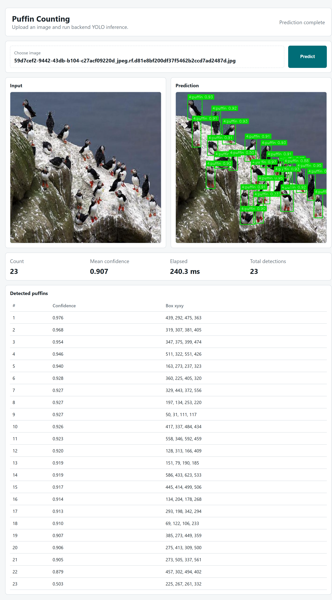
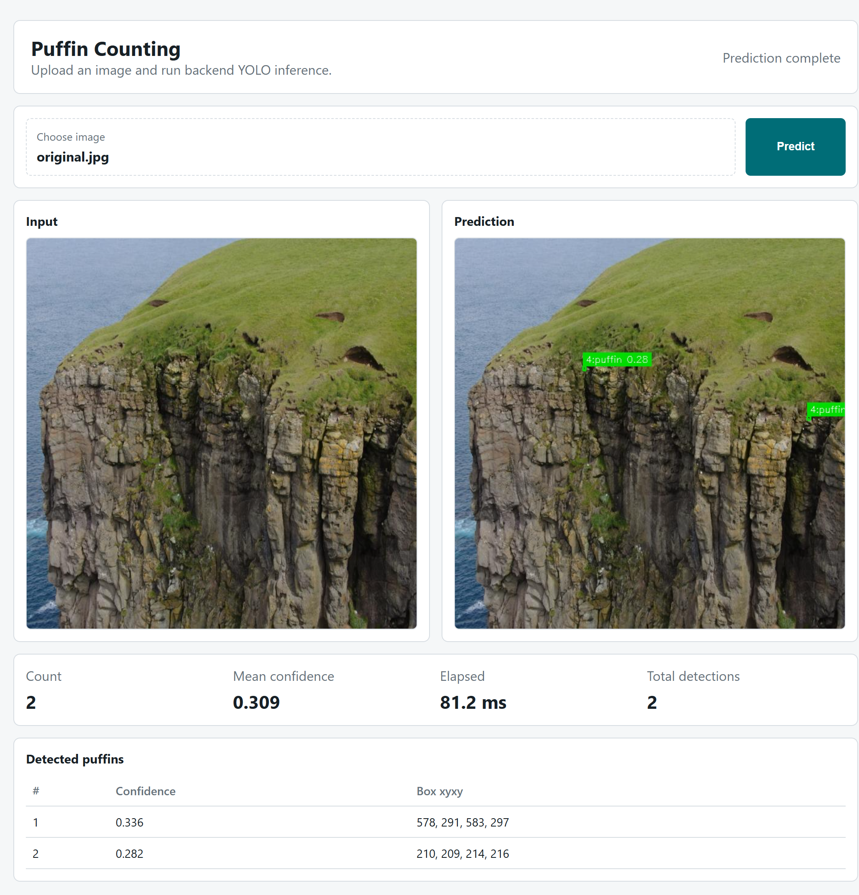
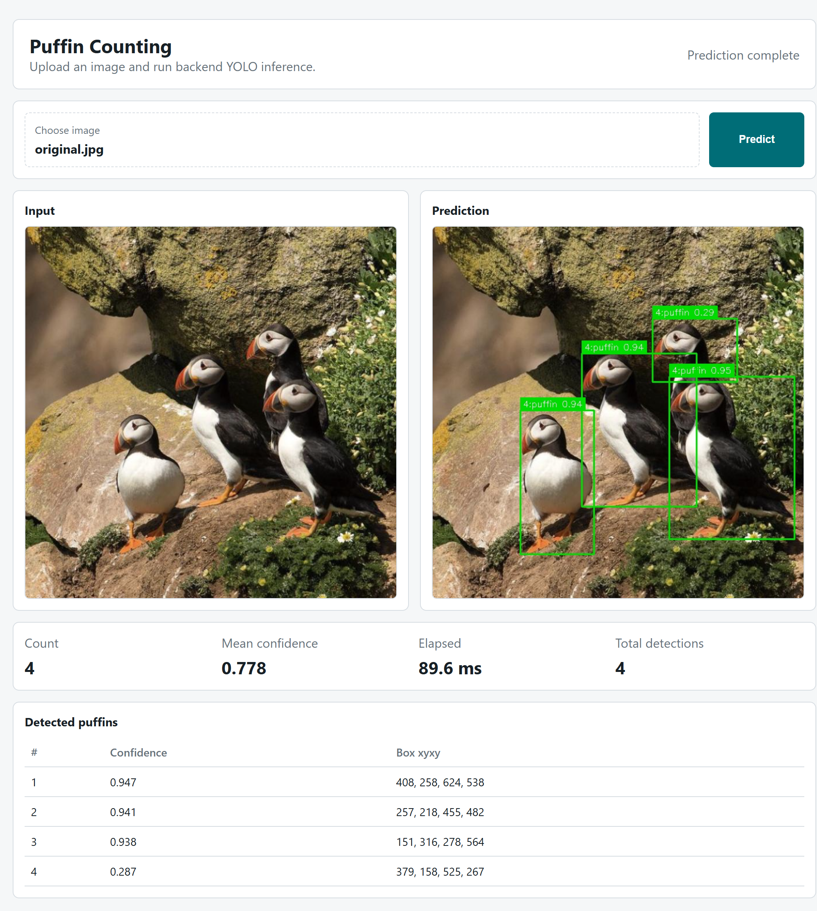

# Puffin Counting Final

## 当前状态

本 demo 已完成课程 final 的主要工程闭环：开源数据集选择与审计、YOLO26n / YOLO11n 训练对比、计数评估、失败案例分析、FastAPI 后端、轻量前端和报告素材整理。最终原型默认使用 YOLO11n 权重进行后端推理，模型权重、训练输出、数据集和提交报告草稿均保留在本地并通过 `.gitignore` 排除。

课程报告已基于本 demo 单独完成并提交，报告源文件和 PDF 位于本地 `submission/` 目录，该目录不进入 Git。

本目录是课程 final 作业的工程工作区，目标是构建一个基于目标检测的 puffin 自动计数原型：用户上传图片，后端调用训练好的 YOLO 模型检测 puffin，并返回计数、检测框和可视化结果。

当前项目包含数据集整理、模型训练与评估、失败案例分析、FastAPI 后端和轻量前端原型。详细实验过程记录见 `EXPERIMENT_LOG.md`；更细的内部工作笔记见 `README.internal.md`。

## 数据集

数据集使用 Roboflow Universe 上的 SeabirdAI / Seabirds v6，格式为 YOLO26。

```text
Dataset: Roboflow Seabirds v6
Format: YOLO
License: CC BY 4.0
Classes: fulmar, gannet, guillemot, kittiwake, puffin, razorbill, shag
```

项目采用原始 train / valid / test 划分，并保留 7 类进行训练；推理和计数阶段只统计 `puffin` 类。

数据集没有提交到 Git。默认本地路径为：

```text
data/Seabirds.v6i.yolo26/
```

## 模型训练与评估

本项目采用检测式计数：先检测每个 puffin 的 bounding box，再统计目标框数量。

已完成两个模型实验：

```text
exp001_yolo26n_baseline
exp002_yolo11n_baseline
```

在 test split 上的计数评估结果：

| Experiment | Model | MAE | RMSE | Bias |
|---|---|---:|---:|---:|
| exp001 | YOLO26n | 0.11905 | 0.59761 | -0.11905 |
| exp002 | YOLO11n | 0.09524 | 0.46291 | 0.00000 |

当前后端默认使用 YOLO11n 的最佳权重：

```text
runs/train/exp002_yolo11n_baseline/weights/best.pt
```

训练输出和权重不提交到 Git。

## 样例结果

复杂场景中 23 个目标全部正确识别：



无人机超远景航拍样例，目标很小，两个模型都容易低估或计数不稳定：



近景重叠样例，最终采用的 YOLO11n 能正确检出全部目标：



更多截图位于 `report_assets/browser_screenshots/`。

## 前后端原型

后端使用 FastAPI，提供：

```text
GET  /health
GET  /model
POST /predict
```

`POST /predict` 接收图片文件，返回：

```text
count
boxes
mean_confidence
all_detections
elapsed_ms
figure_url
```

前端是一个轻量单页页面，用于上传图片并展示后端返回的计数和预测图，不在浏览器端运行模型。

启动后端：

```powershell
cd R:\mlcv-labs\workspace\final-demo
powershell -ExecutionPolicy Bypass -File scripts\run_backend.ps1
```

然后打开：

```text
http://127.0.0.1:8000/
```

后端 smoke test：

```powershell
powershell -ExecutionPolicy Bypass -File scripts\smoke_test_backend.ps1
```

## 项目结构

```text
backend/
  app.py                         # FastAPI 后端

frontend/
  index.html                     # 上传与结果展示页面
  styles.css
  app.js

configs/
  default.yaml                   # 后端和推理配置
  seabirds_v6_local.yaml         # 本地 YOLO 数据配置

src/puffin_counting/
  yolo_predictor.py              # YOLO 推理封装
  model_interface.py             # 预测结果接口
  evaluation.py                  # 计数误差评估
  dataset.py                     # 数据校验
  annotations.py                 # 数据划分工具
  density.py                     # 密度图辅助工具

scripts/
  train_yolo.py                  # 通用 YOLO 训练入口
  train_yolo26n_baseline.ps1
  train_yolo11n_baseline.ps1
  predict_yolo_counts.py
  evaluate_counting.py
  prepare_failure_cases.py
  run_backend.ps1
  smoke_test_backend.py

report_assets/
  browser_screenshots/           # 报告用前端截图与失败案例截图

EXPERIMENT_LOG.md                # 实验记录
README.internal.md               # 内部工作指南
```

## 常用命令

训练 YOLO11n baseline：

```powershell
powershell -ExecutionPolicy Bypass -File scripts\train_yolo11n_baseline.ps1
```

对 test split 推理：

```powershell
powershell -ExecutionPolicy Bypass -File scripts\predict_exp002_test.ps1
```

计算 counting 指标：

```powershell
powershell -ExecutionPolicy Bypass -File scripts\evaluate_exp002_test.ps1
```

整理失败案例素材：

```powershell
powershell -ExecutionPolicy Bypass -File scripts\prepare_failure_cases_exp001_exp002.ps1
```

## Git 说明

以下内容不会提交：

```text
data/
outputs/
runs/
weights/
models/
checkpoints/
```

精选报告截图位于 `report_assets/`，会随仓库提交。
